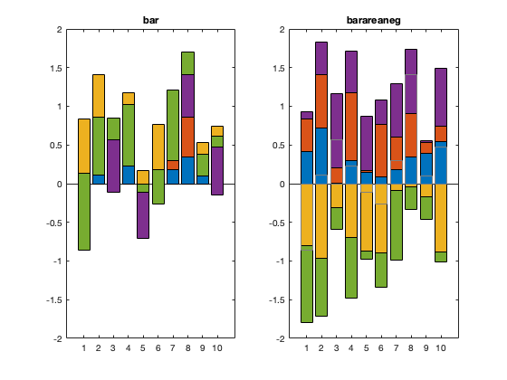
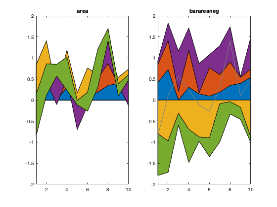

# barareaneg.m: bar or area plot with positive/negative split


Author: Kelly Kearney


This repository includes the code for the `barareaneg.m` Matlab function, along with all dependent functions required to run it.


Matlab's native stacked bar and area plots don't really make sense when you need to visualize both positive and negative data.  This function instead separates out always-postive and always-negative series, and plots them in opposite-facing bar/area plots.


## Contents

            
- Getting started        
- Syntax        
- Description        
- Examples        
- Contributions

## Getting started


**Prerequisites**


This function requires Matlab R14 or later.


**Downloading and installation**


This code can be downloaded from [Github](https://github.com/kakearney/barareaneg-pkg/) or the [MatlabCentral File Exchange](http://www.mathworks.com/matlabcentral/fileexchange/xxxx-example).  The File Exchange entry is updated daily from the GitHub repository.


**Matlab Search Path**


The following folders need to be added to your Matlab Search path (via `addpath`, `pathtool`, etc.):


```matlab
barareaneg-pkg/barareaneg
```


## Syntax


h = barareaneg(x, y, type) h = barareaneg(x, y, type, orient)


## Description


`h = barareaneg(x, y, type)` creates either a stacked bar (`type` = 'bar') or stacked area (`type` = 'area') plot, where the vector `x` indicates the coordinates of the independent variable and the matrix `y` indicates the values of to be stacked; rows of `y` correspond to `x`, and columns indicate values to be stacked.  The output `h` is a structure with handles to the plotted objects.


`h = barareaneg(x, y, type, orient)` indicates whether bars/areas should stack vertically (`orient` = `'v'`) or horizontally (`orient` = `'h'`).


## Examples


We start with stacked data that includes 3 all-positive series and 2 all-negative ones.


```matlab
rng(1); % for replicability only

x = 1:10;
y = rand(10,5);
y(:, [3 5]) = y(:, [3 5])*-1;
```


Matlab's native bar plots display stacked negative data in a cumulative way, such that the blocks that change sign from the previous one overlay each other.  The `barareaneg` function instead splits the postivie and negative, which may be a more desirable way to display data, depending on the application.


```matlab
col = get(0, 'DefaultAxesColorOrder');
col = num2cell(col(1:5,:),2);

figure;
ax(1) = subplot(1,2,1);
hb = bar(x,y,'stacked');
title('bar');
set(hb, {'facecolor'}, col);

ax(2) = subplot(1,2,2);
h = barareaneg(x,y,'bar');
title('barareaneg');
set(h.pos, {'facecolor'}, col);
set(h.neg, {'facecolor'}, col);
set(ax, 'ylim', [-2 2]);
```




The same behavior is seen in stacked area plots.


```matlab
figure;
ax(1) = subplot(1,2,1);
ha = area(x,y);
title('area');
set(ha, {'facecolor'}, col);

ax(2) = subplot(1,2,2);
h = barareaneg(x,y,'area');
title('barareaneg');
set(h.pos, {'facecolor'}, col);
set(h.neg, {'facecolor'}, col);
set(ax, 'ylim', [-2 2], 'xlim', [1 10]);
```





## Contributions


Community contributions to this package are welcome!


To report bugs, please submit [an issue](https://github.com/kakearney/barareaneg-pkg/issues) on GitHub and include:


  - your operating system
  - your version of Matlab and all relevant toolboxes (type `ver` at the Matlab command line to get this info)
  - code/data to reproduce the error or buggy behavior, and the full text of any error messages received

Please also feel free to submit enhancement requests, or to send pull requests (via GitHub) for bug fixes or new features.


I do monitor the MatlabCentral FileExchange entry for any issues raised in the comments, but would prefer to track issues on GitHub.


<sub>[Published with MATLAB R2019a]("http://www.mathworks.com/products/matlab/")</sub>
